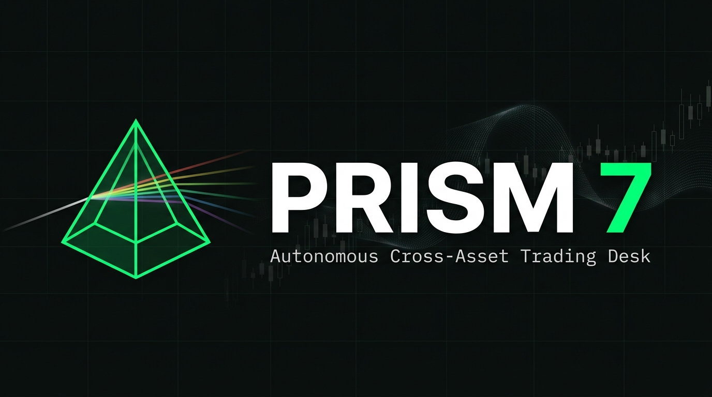

<p align="center">
  
</p>

<h1 align="center">PRISM 7</h1>
<p align="center">
  <strong>Autonomous Cross-Asset Quantitative Trading Desk</strong><br/>
  <em>Multi-Agent AI • Tokenized Equities • Native Crypto • 7×24 Continuous Liquidity</em>
</p>

<p align="center">
  <a href="https://vitejs.dev/"></a>
  <a href="https://react.dev/"></a>
  <a href="https://www.typescriptlang.org/"></a>
  <a href="https://tailwindcss.com/"></a>
  <a href="https://oxc.rs/"></a>
</p>

---

## Overview

Traditional financial markets freeze liquidity for **128 out of 168 hours every week**. PRISM 7 eliminates this structural inefficiency by establishing continuous, round-the-clock autonomous trading across two convergent asset universes:

| Universe | Assets |
| :--- | :--- |
| **Tokenized US Equities** | `rNVDA` · `rTSLA` · `rAAPL` · `rMSFT` · `rMSTR` · `rCOIN` |
| **Crypto & Decentralized Compute** | `BTC/USDT` · `ETH/USDT` · `RENDER` · `TAO` · `FET` |

Powered by a **Qwen 3.8-Max multi-agent cognitive architecture**, the platform deploys autonomous quantitative agents that debate trade proposals, exploit weekend macroeconomic disclosures, frontrun cash market opens, audit corporate SEC 8-K filings, and capture cross-asset statistical divergences — all without human intervention.

---

## Architecture

```
                               ┌──────────────────────────────────────────────┐
                               │       Qwen 3.8-Max Multi-Agent LLM           │
                               │  (Alpha Hunter ↔ Risk Comptroller ↔ Arbiter) │
                               └──────────────────────▲───────────────────────┘
                                                      │ Secure Server Proxy
                                                      ▼
┌────────────────────────────────────────────────────────────────────────────────────────────┐
│                                     PRISM 7 TRADING DESK                                  │
├────────────────────────────────────────────────────────────────────────────────────────────┤
│  Dialectic Desk    ChronoArb 7×24    Silicon Symbiosis   ForensicAlpha   CascadeGuard     │
│  Adversarial AI    Gap Frontrunner   Cross-Asset StatArb  SEC 8-K Radar  Vacuum Sweeper   │
├────────────────────────────────────────────────────────────────────────────────────────────┤
│                  Autonomous Autopilot Loop (25s Scan Cycles + VaR Circuit Breakers)       │
├────────────────────────────────────────────────────────────────────────────────────────────┤
│                 PARA Copilot: Natural Language Function Calling & App State Control       │
├────────────────────────────────────────────────────────────────────────────────────────────┤
│            Real-Time L2 Order Book & VWAP Slippage Radar (Books15 Depth + Impact)        │
└───────────────────▲──────────────────────────────────▲─────────────────────▲──────────────┘
                    │                                  │                     │
      Bitget Public WebSocket             Yahoo Finance API Proxy    SEC EDGAR API Proxy
   (Live Crypto Tickers & Books15)       (Live US Equity Data)      (Official 8-K Filings)
```

> All external API calls are routed through a **server-side proxy layer** (Node.js / Vite middleware). API keys and secrets are injected at the server level and **never exposed to the client bundle**.

---

## Quantitative Engines

### 1 · Dialectic Adversarial Desk

A multi-agent debate framework where competing AI personas stress-test every trade thesis:

- **Agent Alpha (The Hunter)** — Opportunistic PM proposing asymmetric risk-reward setups based on order book depth imbalances.
- **Agent Omega (Chief Risk Comptroller)** — Ruthless risk officer auditing tail-risk, thin liquidity, and Value-at-Risk parameters.
- **Synthesis Arbiter** — Evaluates both arguments, ruling `APPROVED`, `DOWNSIZED`, or `VETOED` with quantitative sizing constraints.

### 2 · ChronoArb 7×24 — Macro Gap Frontrunner

Ingests real-time geopolitical, central bank, and regulatory wire alerts. Evaluates implied Monday TradFi cash open gaps (±1.0% to ±5.0%) and pre-emptively deploys synthetic rToken perpetual positions over weekends to capture price discovery ahead of Wall Street opening bells.

### 3 · Silicon Symbiosis — Cross-Asset AI Supply Chain Arbitrage

Models the structural lead-lag relationship between tokenized US hardware guidance (NVIDIA, Microsoft, Coinbase) and decentralized AI compute tokens (Render, Bittensor, FET). Computes **Pearson Correlation Coefficients** and **Rolling Spread Z-Scores** over 30-day series, triggering dual-leg mean-reversion trades when statistical divergence exceeds ±1.2σ to ±2.0σ.

### 4 · ForensicAlpha — SEC EDGAR 8-K Guidance Radar

Connects directly to the **Official SEC EDGAR API** to ingest corporate 8-K, 10-Q, and 10-K filings with direct `sec.gov` archive links. Qwen 3.8-Max runs linguistic forensic audits to detect discrepancies between headline EPS beats and cautionary forward-looking tone (`FADE_THE_POP` vs. `BUY_THE_DIP`).

### 5 · CascadeGuard — Liquidity Vacuum & Phantom Discount Sweeper

Scans order books for microstructure flash crashes and shallow depth pockets (<$1.2M depth). Deploys multi-tier ladder sweep bids coupled with correlated crypto delta hedges (e.g., Long `rMSTR` + Short `BTC/USDT`).

---

## Autopilot & Execution

| Feature | Details |
| :--- | :--- |
| **Scan Cycle** | Continuous 25-second loop: Health → VaR → Liquidity → StatArb → Dialectic routing |
| **VaR Circuit Breakers** | Automatically halts execution if portfolio drawdown exceeds configurable thresholds |
| **Emergency Override** | One-click killswitch: halts autonomous loop and liquidates all open positions |
| **Paper Trading** | High-fidelity local ledger with real-time mark-to-market, VWAP slippage estimation, and portfolio analytics |
| **Live Execution** | Direct Bitget API V2 integration with cryptographic HMAC-SHA256 request signing |

---

## PARA Copilot

A natural language interface powered by Qwen 3.8-Max that translates plain-English commands into executable actions:

```
"Buy $500 of RENDER"          →  TRADE action
"Show me the BTC order book"  →  ORDER_BOOK modal
"Start autopilot"             →  AUTOPILOT activation
"Liquidate everything"        →  LIQUIDATE all positions
"Go to the SEC desk"          →  NAVIGATE to ForensicAlpha
```

The copilot maintains full conversation context and can chain multiple actions in a single response.

---

## Tech Stack

| Layer | Technology |
| :--- | :--- |
| **Runtime** | Vite 8.3 · React 19 · TypeScript 6.0 |
| **Styling** | Tailwind CSS v4 · Neo-Brutalist design system · JetBrains Mono |
| **AI Engine** | Qwen 3.8-Max (multi-turn reasoning, tool-use, dialectic debate) |
| **Market Data** | Bitget WebSocket v2 (crypto) · Yahoo Finance (equities) |
| **Filings** | SEC EDGAR Submissions API · Full-text document extraction |
| **Execution** | Bitget REST API V2 · HMAC-SHA256 signing · Paper + Live modes |
| **Code Quality** | Oxlint (0 warnings) · Strict TypeScript · Production-verified builds |

---

## Getting Started

### Prerequisites

- [Node.js](https://nodejs.org/) **v18.0+**
- npm **v9.0+**

### Environment Setup

Create a `.env` file in the project root:

```bash
# Server-side only — never prefixed with VITE_ to prevent client exposure
QWEN_API_KEY=your_api_key_here
QWEN_BASE_URL=https://your-api-endpoint.com
QWEN_MODEL=qwen3.8-max
```

> [!IMPORTANT]
> All secrets are exclusively accessed by the server-side proxy middleware. They are **never** bundled into the client JavaScript. Do not use the `VITE_` prefix for any sensitive values.

### Install & Run

```bash
# Install dependencies
npm install

# Start development server
npm run dev

# Lint (verify 0 warnings)
npm run lint

# Production build
npm run build

# Preview production build
npm run preview
```

The application launches at `http://localhost:5173` (or the next available port).

---

## Verify AI Connectivity

Test the multi-agent AI pipeline by querying the secure proxy:

```bash
# Check proxy health
curl http://localhost:5173/api/qwen/status

# Test Qwen completion
curl -X POST http://localhost:5173/api/qwen/chat/completions \
  -H "Content-Type: application/json" \
  -d '{
    "model": "qwen3.8-max",
    "messages": [{"role": "user", "content": "Say hello in 5 words."}],
    "max_tokens": 30
  }'
```

---

## Security Model

| Principle | Implementation |
| :--- | :--- |
| **Zero Client-Side Secrets** | All API keys held in `.env`, injected by Node.js proxy middleware at runtime |
| **No `VITE_` Prefix** | Prevents accidental bundling of secrets into client JavaScript |
| **HMAC-SHA256 Signing** | Bitget trade requests cryptographically signed using Web Crypto API |
| **SEC Fair Access** | All EDGAR requests include compliant User-Agent telemetry |
| **VaR Safety Rails** | Algorithmic circuit breakers prevent runaway automated execution |

---

## Project Structure

```
├── src/
│   ├── components/
│   │   ├── common/          # Navbar, SystemStatus, Buttons, Modals
│   │   ├── desk/            # Trading desk views (5 engines + Autopilot)
│   │   ├── copilot/         # PARA natural language interface
│   │   └── orderbook/       # L2 depth visualization & VWAP radar
│   ├── services/
│   │   ├── marketService.ts       # WebSocket + REST market data
│   │   ├── qwenService.ts         # AI multi-agent orchestration
│   │   ├── bitgetTradingService.ts # Order execution & signing
│   │   ├── secEdgarService.ts     # SEC filing ingestion
│   │   └── portfolioService.ts    # Paper trading ledger & analytics
│   ├── types/               # TypeScript interfaces & enums
│   └── utils/               # Shared utilities & formatters
├── docs/                    # Documentation & assets
├── vite.config.ts           # Server proxy & security middleware
├── .env                     # Server-side secrets (gitignored)
└── package.json
```

---

## License

Proprietary — PRISM 7 Quantitative Trading Architecture.
